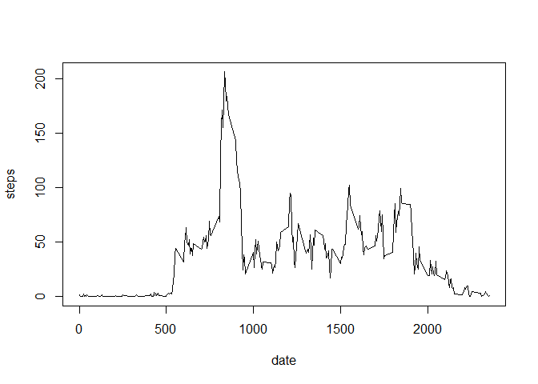

# Reproducible Research: Peer Assessment 1

### Loading and preprocessing the data
The following code reads in the activity data file and converts the date field.

Afterwards it produces a summary and computes the mean steps per day.

```r
temp <- tempfile()
download.file("http://d396qusza40orc.cloudfront.net/repdata%2Fdata%2Factivity.zip",temp)
activity <- read.csv(unz(temp, "activity.csv"))
str(activity)
```

```
## 'data.frame':	17568 obs. of  3 variables:
##  $ steps   : int  NA NA NA NA NA NA NA NA NA NA ...
##  $ date    : Factor w/ 61 levels "2012-10-01","2012-10-02",..: 1 1 1 1 1 1 1 1 1 1 ...
##  $ interval: int  0 5 10 15 20 25 30 35 40 45 ...
```

```r
activity$date<-as.Date(activity$date,"%Y-%m-%d")
summary(activity)
```

```
##      steps            date               interval   
##  Min.   :  0.0   Min.   :2012-10-01   Min.   :   0  
##  1st Qu.:  0.0   1st Qu.:2012-10-16   1st Qu.: 589  
##  Median :  0.0   Median :2012-10-31   Median :1178  
##  Mean   : 37.4   Mean   :2012-10-31   Mean   :1178  
##  3rd Qu.: 12.0   3rd Qu.:2012-11-15   3rd Qu.:1766  
##  Max.   :806.0   Max.   :2012-11-30   Max.   :2355  
##  NA's   :2304
```

```r
Tage <-aggregate(activity$steps, by=list(Date=activity$date), FUN="sum", na.rm=TRUE)
meansteps<-mean(Tage$x, na.rm = T)
```

### What is mean total number of steps taken per day?

The mean number of steps per day is 9354.2295.

  

### What is the average daily activity pattern?

```r
Minuten <-aggregate(activity$steps, by=list(Date=activity$interval), FUN="mean", na.rm=TRUE)

par(mfrow=c(1,1))
with(Minuten,{
  plot(Date,x,type="l",ylab="steps",xlab="date")})
```

 


### Imputing missing values

 Get the location of the NA values.

```r
nanew <-aggregate(activity$steps, by=list(Date=activity$interval), FUN="median", na.rm=TRUE)
naindex <- which(is.na(activity$steps)==TRUE)
#activity$steps[naindex,1] <- nanew$x[naindex]
```

### Are there differences in activity patterns between weekdays and weekends?

```
## [1] "English_United States.1252"
```

 

